# Value Implementation Diagrams

Architecture diagrams for all Rego Value implementations — baseline through v9.
Designed for PowerPoint presentations.

---

## Overview: Value Size Evolution

```mermaid
graph LR
  subgraph EVOLUTION["<b>Value Size Evolution</b>"]
    direction LR
    BL["<b>Baseline</b><br/>40 bytes<br/>Rc+BTreeMap"]
    V1["<b>v1</b><br/>24 bytes<br/>HashMap+SmolStr"]
    V2["<b>v2</b><br/>24 bytes<br/>HashMap+Arc&lt;str&gt;"]
    V3["<b>v3</b><br/>24 bytes<br/>HashSet+cached_hash"]
    V4["<b>v4</b><br/>16 bytes<br/>ArcStr thin ptr"]
    V5["<b>v5</b><br/>8 bytes<br/>NaN boxing"]
    V6["<b>v6</b><br/>8 bytes<br/>Tagged pointer"]
    V7["<b>v7</b><br/>8 bytes<br/>+Schema sharing"]
    V8["<b>v8</b><br/>16 bytes<br/>Flat enum+Schema"]
    V9["<b>v9</b><br/>16 bytes<br/>Arena Copy+Ext"]
  end

  BL --> V1 --> V2 --> V3 --> V4 --> V5 --> V6 --> V7 --> V8 --> V9

  style BL fill:#d63031,color:#fff
  style V1 fill:#e17055,color:#fff
  style V2 fill:#e17055,color:#fff
  style V3 fill:#e17055,color:#fff
  style V4 fill:#fdcb6e,color:#2d3436
  style V5 fill:#00b894,color:#fff
  style V6 fill:#00b894,color:#fff
  style V7 fill:#00b894,color:#fff
  style V8 fill:#0984e3,color:#fff
  style V9 fill:#6c5ce7,color:#fff
```

---

## Baseline: regorus::Value — 40 bytes

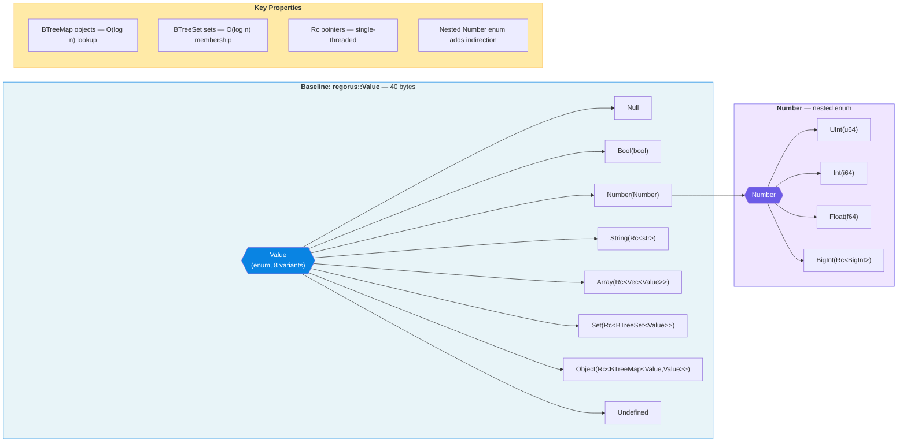

---

## v1: HashMap + SmolStr — 24 bytes

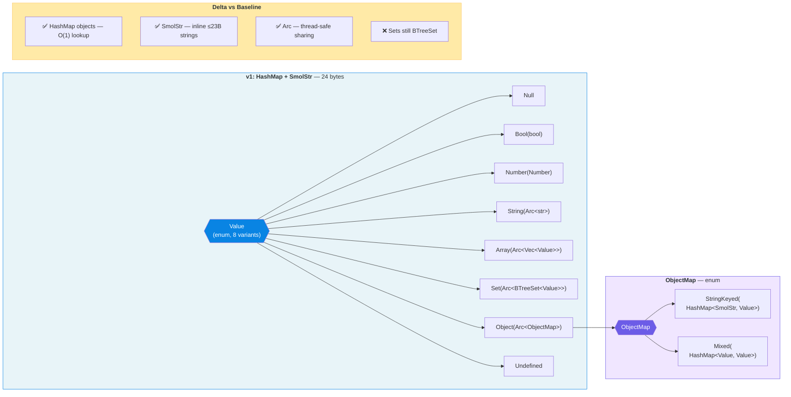

---

## v2: HashMap + Arc\<str\> — 24 bytes

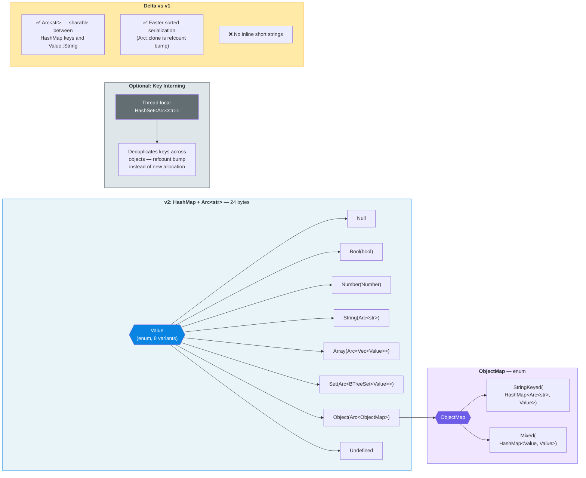

---

## v3: HashSet + Cached Hash — 24 bytes

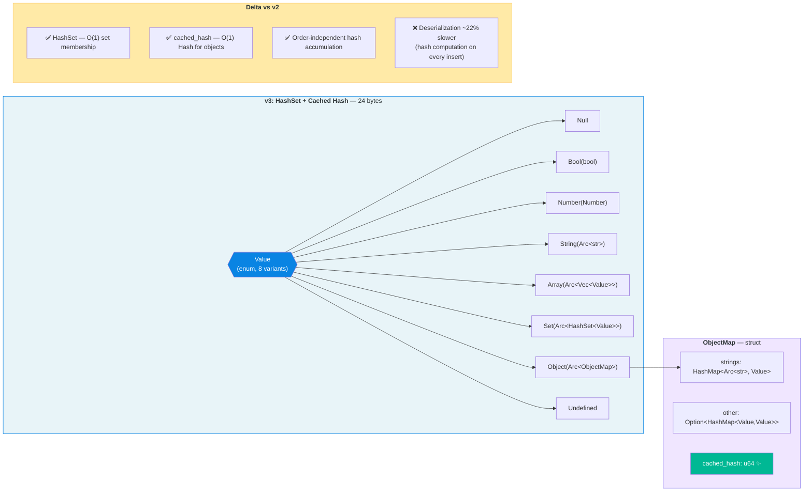

---

## v4: ArcStr Thin Pointer — 16 bytes

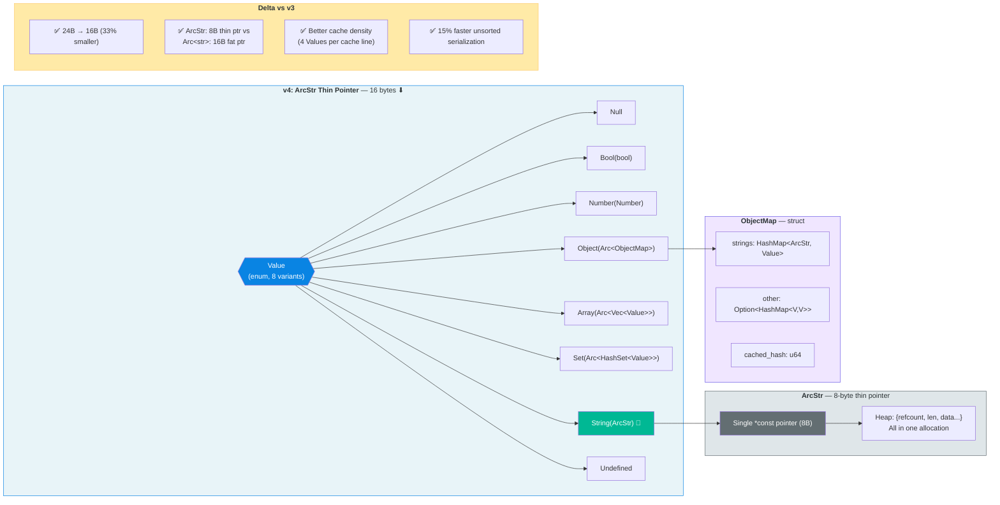

---

## v5: NaN-Boxed Value — 8 bytes

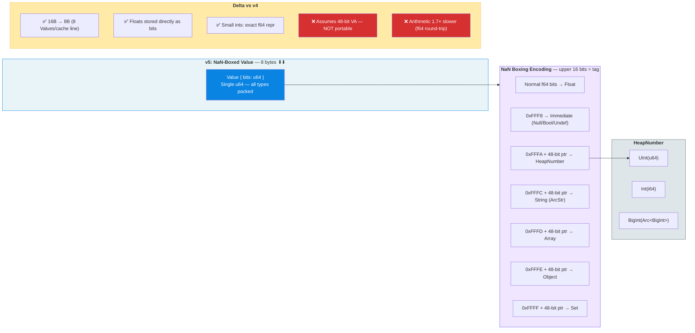

---

## v6: Portable Tagged Pointer — 8 bytes

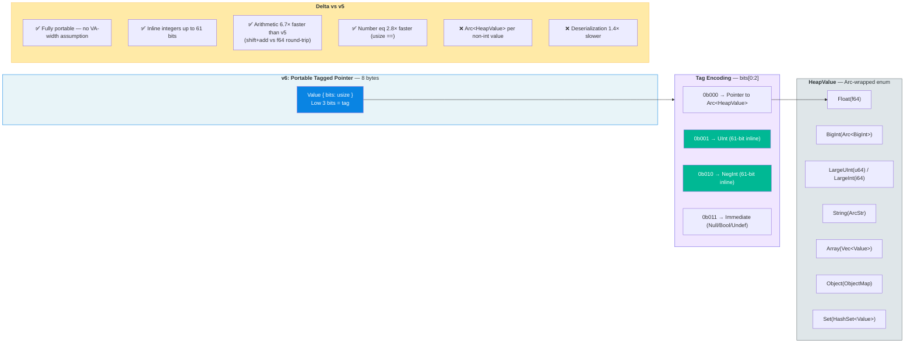

---

## v7: Schema-Shared Compact Objects — 8 bytes

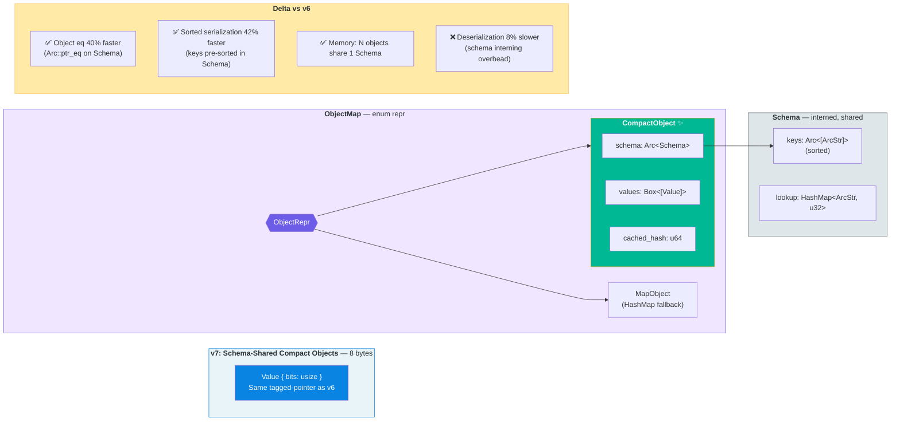

---

## v8: 16-Byte Enum + Flattened Number + Schema — 16 bytes

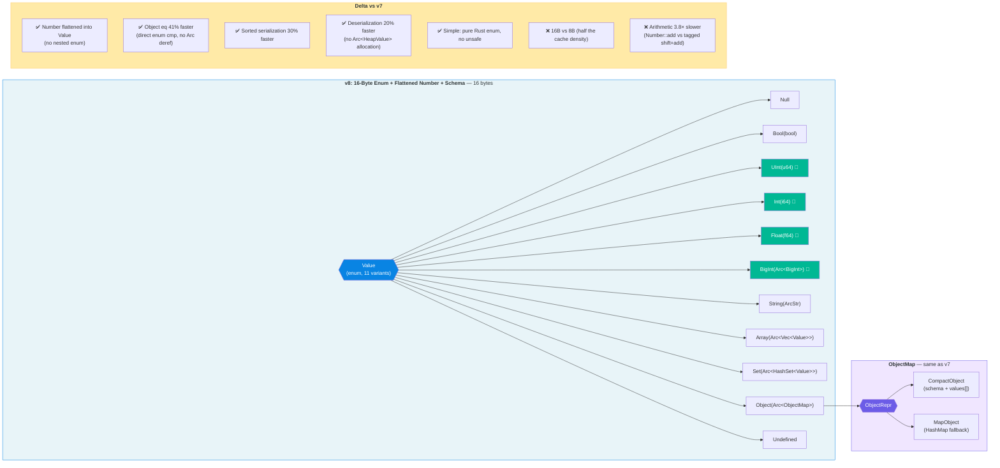

---

## v9: Arena Two-Enum + Schema + v8 Interop — 16 bytes, Copy

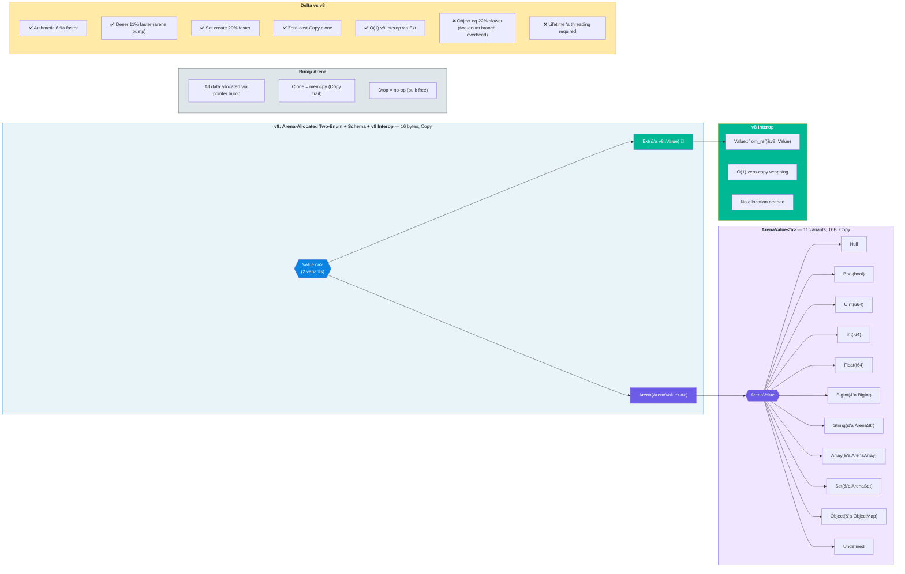

---

## Color Legend

| Color | Meaning |
|-------|---------|
| 🔵 Blue | Value type (main enum / wrapper) |
| 🟣 Purple | Inner type (Number, ArenaValue, ObjectRepr) |
| 🟢 Green | Key innovation for that version |
| 🟡 Yellow | Delta / change notes |
| ⬜ Gray | Supporting types (ArcStr, HeapValue, Arena) |
| 🔴 Red | Portability / performance concern |
