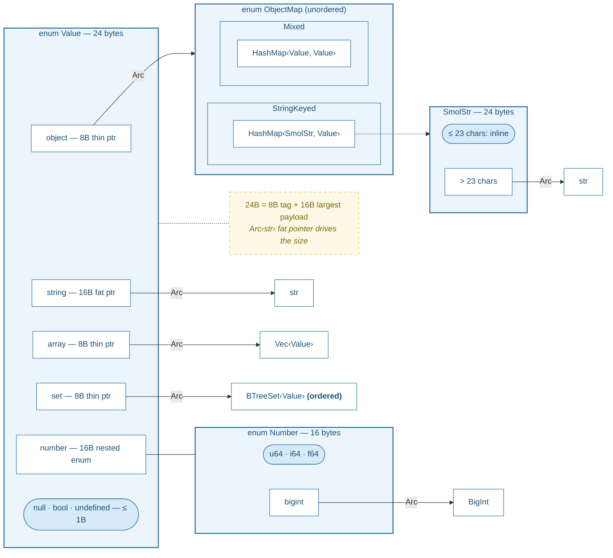

# v1: HashMap + SmolStr

```mermaid
graph LR
  subgraph V["enum Value — 24 bytes"]
    direction TB
    OBJ["object — 8B thin ptr"]
    STR["string — 16B fat ptr"]
    ARR["array — 8B thin ptr"]
    SET["set — 8B thin ptr"]
    NUM["number — 16B nested enum"]
    INLINE(["null · bool · undefined — ≤ 1B"])
  end

  V -.- NOTE["24B = 8B tag + 16B largest payload<br/><i>Arc‹str› fat pointer drives the size</i>"]

  OBJ -->|Arc| OBJMAP
  STR -->|Arc| A1["str"]
  ARR -->|Arc| A2["Vec‹Value›"]
  SET -->|Arc| A3["BTreeSet‹Value› <b>(ordered)</b>"]
  NUM --- NUMBOX

  subgraph NUMBOX["enum Number — 16 bytes"]
    direction TB
    N1(["u64 · i64 · f64"])
    N4["bigint"]
  end

  N4 -->|Arc| A0["BigInt"]

  subgraph OBJMAP["enum ObjectMap (unordered)"]
    direction TB
    subgraph SKBOX[" StringKeyed "]
      SKHM["HashMap‹SmolStr, Value›"]
    end
    subgraph MXBOX[" Mixed "]
      MXHM["HashMap‹Value, Value›"]
    end
  end

  SKHM -.-> SMOLBOX

  subgraph SMOLBOX["SmolStr — 24 bytes"]
    direction TB
    SMINLINE(["≤ 23 chars: inline"])
    SMHEAP["> 23 chars"]
  end

  SMHEAP -->|Arc| SMSTR["str"]

  style V fill:#EBF5FB,color:#1A5276,stroke:#2471A3,stroke-width:2px
  style OBJ fill:#fff,color:#1A5276,stroke:#2471A3
  style STR fill:#fff,color:#1A5276,stroke:#2471A3
  style ARR fill:#fff,color:#1A5276,stroke:#2471A3
  style SET fill:#fff,color:#1A5276,stroke:#2471A3
  style NUM fill:#fff,color:#1A5276,stroke:#2471A3
  style N4 fill:#fff,color:#1A5276,stroke:#2471A3
  style NUMBOX fill:#EBF5FB,color:#1A5276,stroke:#2471A3,stroke-width:2px
  style INLINE fill:#D6EAF8,color:#1A5276,stroke:#2471A3
  style N1 fill:#D6EAF8,color:#1A5276,stroke:#2471A3
  style A0 fill:#fff,color:#1A5276,stroke:#2471A3
  style A1 fill:#fff,color:#1A5276,stroke:#2471A3
  style A2 fill:#fff,color:#1A5276,stroke:#2471A3
  style A3 fill:#fff,color:#1A5276,stroke:#2471A3
  style OBJMAP fill:#EBF5FB,color:#1A5276,stroke:#2471A3,stroke-width:2px
  style SKBOX fill:#EBF5FB,color:#1A5276,stroke:#2471A3
  style SKHM fill:#fff,color:#1A5276,stroke:#2471A3
  style MXBOX fill:#EBF5FB,color:#1A5276,stroke:#2471A3
  style MXHM fill:#fff,color:#1A5276,stroke:#2471A3
  style SMOLBOX fill:#EBF5FB,color:#1A5276,stroke:#2471A3,stroke-width:2px
  style SMINLINE fill:#D6EAF8,color:#1A5276,stroke:#2471A3
  style SMHEAP fill:#fff,color:#1A5276,stroke:#2471A3
  style SMSTR fill:#fff,color:#1A5276,stroke:#2471A3
  style NOTE fill:#FEF9E7,color:#7D6608,stroke:#F1C40F,stroke-dasharray:5 5
```
