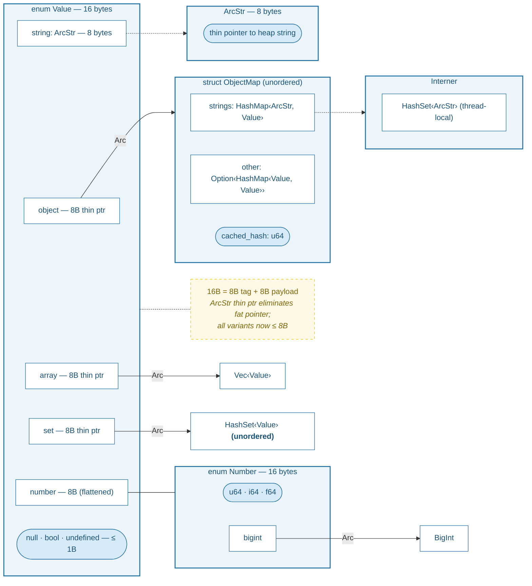

# v4: ArcStr thin pointer (16-byte Value)

```mermaid
graph LR
  subgraph V["enum Value — 16 bytes"]
    direction TB
    OBJ["object — 8B thin ptr"]
    STR["string: ArcStr — 8B thin ptr"]
    ARR["array — 8B thin ptr"]
    SET["set — 8B thin ptr"]
    NUM["number — 8B (flattened)"]
    INLINE(["null · bool · undefined — ≤ 1B"])
  end

  V -.- NOTE["16B = 8B tag + 8B payload<br/><i>ArcStr thin ptr eliminates fat pointer;<br/>all variants now ≤ 8B</i>"]

  OBJ -->|Arc| OBJMAP
  STR["string: ArcStr — 8 bytes"]
  ARR -->|Arc| A2["Vec‹Value›"]
  SET -->|Arc| A3["HashSet‹Value› <b>(unordered)</b>"]
  NUM --- NUMBOX

  subgraph NUMBOX["enum Number — 16 bytes"]
    direction TB
    N1(["u64 · i64 · f64"])
    N4["bigint"]
  end

  N4 -->|Arc| A0["BigInt"]

  subgraph OBJMAP["struct ObjectMap (unordered)"]
    direction TB
    SKHM["strings: HashMap‹ArcStr, Value›"]
    MXHM["other: Option‹HashMap‹Value, Value››"]
    HASH(["cached_hash: u64"])
  end

  subgraph INTERN["Interner"]
    direction TB
    ICACHE["HashSet‹ArcStr› (thread-local)"]
  end

  SKHM -.-> INTERN

  subgraph ARCSTR["ArcStr — 8 bytes"]
    direction TB
    ASPTR(["thin pointer to heap string"])
  end

  STR -.-> ARCSTR

  style V fill:#EBF5FB,color:#1A5276,stroke:#2471A3,stroke-width:2px
  style OBJ fill:#fff,color:#1A5276,stroke:#2471A3
  style STR fill:#fff,color:#1A5276,stroke:#2471A3
  style ARR fill:#fff,color:#1A5276,stroke:#2471A3
  style SET fill:#fff,color:#1A5276,stroke:#2471A3
  style NUM fill:#fff,color:#1A5276,stroke:#2471A3
  style INLINE fill:#D6EAF8,color:#1A5276,stroke:#2471A3
  style N1 fill:#D6EAF8,color:#1A5276,stroke:#2471A3
  style N4 fill:#fff,color:#1A5276,stroke:#2471A3
  style NUMBOX fill:#EBF5FB,color:#1A5276,stroke:#2471A3,stroke-width:2px
  style A0 fill:#fff,color:#1A5276,stroke:#2471A3
  style A2 fill:#fff,color:#1A5276,stroke:#2471A3
  style A3 fill:#fff,color:#1A5276,stroke:#2471A3
  style OBJMAP fill:#EBF5FB,color:#1A5276,stroke:#2471A3,stroke-width:2px
  style SKHM fill:#fff,color:#1A5276,stroke:#2471A3
  style MXHM fill:#fff,color:#1A5276,stroke:#2471A3
  style HASH fill:#D6EAF8,color:#1A5276,stroke:#2471A3
  style INTERN fill:#EBF5FB,color:#1A5276,stroke:#2471A3,stroke-width:2px
  style ICACHE fill:#fff,color:#1A5276,stroke:#2471A3
  style ARCSTR fill:#EBF5FB,color:#1A5276,stroke:#2471A3,stroke-width:2px
  style ASPTR fill:#D6EAF8,color:#1A5276,stroke:#2471A3
  style NOTE fill:#FEF9E7,color:#7D6608,stroke:#F1C40F,stroke-dasharray:5 5
```
