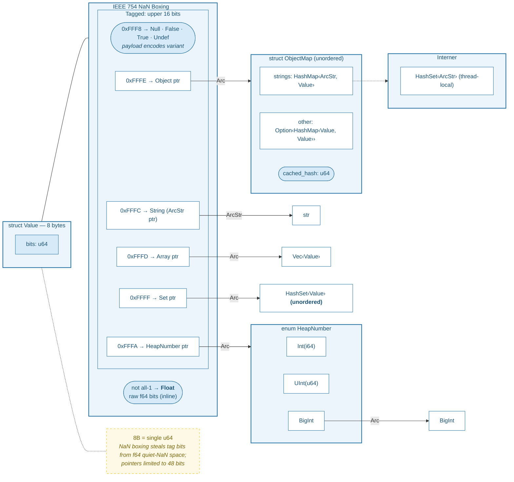

# v5: NaN-boxed Value (8 bytes)

```mermaid
graph LR
  subgraph V["struct Value — 8 bytes"]
    direction TB
    BITS["bits: u64"]
  end

  V -.- NOTE["8B = single u64<br/><i>NaN boxing steals tag bits from f64 quiet-NaN space;<br/>pointers limited to 48 bits</i>"]

  subgraph NANBOX["IEEE 754 NaN Boxing<br/>top 13 bits all-1 → tagged value<br/>otherwise → raw f64"]
    direction TB
    FLT(["not all-1 → <b>Float</b><br/>raw f64 bits (inline)"])
    subgraph TAGGED["Tagged: upper 16 bits"]
      direction TB
      IMM(["0xFFF8 → Null · False · True · Undef<br/><i>payload encodes variant</i>"])
      NPTR["0xFFFA → HeapNumber ptr"]
      SPTR["0xFFFC → String (ArcStr ptr)"]
      APTR["0xFFFD → Array ptr"]
      OPTR["0xFFFE → Object ptr"]
      SETPTR["0xFFFF → Set ptr"]
    end
  end

  V --- NANBOX

  SPTR -->|ArcStr| A1["str"]
  APTR -->|Arc| A2["Vec‹Value›"]
  OPTR -->|Arc| OBJMAP
  SETPTR -->|Arc| A3["HashSet‹Value› <b>(unordered)</b>"]

  subgraph HEAPNUM["enum HeapNumber"]
    direction TB
    HN1["Int(i64)"]
    HN2["UInt(u64)"]
    HN3["BigInt"]
  end

  NPTR -->|Arc| HEAPNUM
  HN3 -->|Arc| A0["BigInt"]

  subgraph OBJMAP["struct ObjectMap (unordered)"]
    direction TB
    SKHM["strings: HashMap‹ArcStr, Value›"]
    MXHM["other: Option‹HashMap‹Value, Value››"]
    HASH(["cached_hash: u64"])
  end

  subgraph INTERN["Interner"]
    direction TB
    ICACHE["HashSet‹ArcStr› (thread-local)"]
  end

  SKHM -.-> INTERN

  style V fill:#EBF5FB,color:#1A5276,stroke:#2471A3,stroke-width:2px
  style BITS fill:#D6EAF8,color:#1A5276,stroke:#2471A3
  style NANBOX fill:#EBF5FB,color:#1A5276,stroke:#2471A3,stroke-width:2px
  style TAGGED fill:#EBF5FB,color:#1A5276,stroke:#2471A3
  style FLT fill:#D6EAF8,color:#1A5276,stroke:#2471A3
  style IMM fill:#D6EAF8,color:#1A5276,stroke:#2471A3
  style SPTR fill:#fff,color:#1A5276,stroke:#2471A3
  style APTR fill:#fff,color:#1A5276,stroke:#2471A3
  style OPTR fill:#fff,color:#1A5276,stroke:#2471A3
  style SETPTR fill:#fff,color:#1A5276,stroke:#2471A3
  style NPTR fill:#fff,color:#1A5276,stroke:#2471A3
  style A1 fill:#fff,color:#1A5276,stroke:#2471A3
  style A2 fill:#fff,color:#1A5276,stroke:#2471A3
  style A3 fill:#fff,color:#1A5276,stroke:#2471A3
  style A0 fill:#fff,color:#1A5276,stroke:#2471A3
  style HEAPNUM fill:#EBF5FB,color:#1A5276,stroke:#2471A3,stroke-width:2px
  style HN1 fill:#fff,color:#1A5276,stroke:#2471A3
  style HN2 fill:#fff,color:#1A5276,stroke:#2471A3
  style HN3 fill:#fff,color:#1A5276,stroke:#2471A3
  style OBJMAP fill:#EBF5FB,color:#1A5276,stroke:#2471A3,stroke-width:2px
  style SKHM fill:#fff,color:#1A5276,stroke:#2471A3
  style MXHM fill:#fff,color:#1A5276,stroke:#2471A3
  style HASH fill:#D6EAF8,color:#1A5276,stroke:#2471A3
  style INTERN fill:#EBF5FB,color:#1A5276,stroke:#2471A3,stroke-width:2px
  style ICACHE fill:#fff,color:#1A5276,stroke:#2471A3
  style NOTE fill:#FEF9E7,color:#7D6608,stroke:#F1C40F,stroke-dasharray:5 5
```
