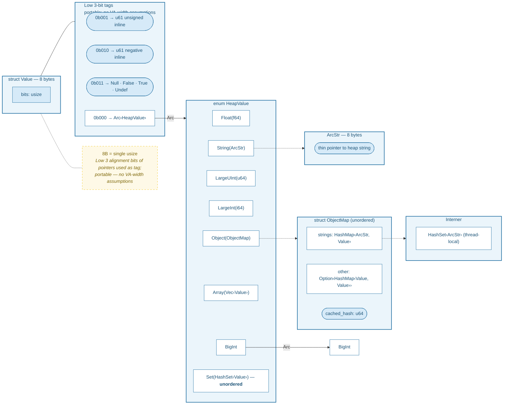

# v6: Portable tagged pointer (8 bytes)

```mermaid
graph LR
  subgraph V["struct Value — 8 bytes"]
    direction TB
    BITS["bits: usize"]
  end

  V -.- NOTE["8B = single usize<br/><i>Low 3 alignment bits of pointers used as tag;<br/>portable — no VA-width assumptions</i>"]

  subgraph TAGS["Low 3-bit tags<br/>portable: no VA-width assumptions"]
    direction TB
    UINT(["0b001 → u61 unsigned inline"])
    NINT(["0b010 → u61 negative inline"])
    IMM(["0b011 → Null · False · True · Undef"])
    PTR["0b000 → Arc‹HeapValue›"]
  end

  V --- TAGS

  subgraph HEAP["enum HeapValue"]
    direction TB
    HF["Float(f64)"]
    HBI["BigInt"]
    HLU["LargeUInt(u64)"]
    HLI["LargeInt(i64)"]
    HS["String(ArcStr)"]
    HA["Array(Vec‹Value›)"]
    HO["Object(ObjectMap)"]
    HSE["Set(HashSet‹Value›) — <b>unordered</b>"]
  end

  PTR -->|Arc| HEAP
  HBI -->|Arc| A0["BigInt"]
  HS -.-> ARCSTR

  subgraph OBJMAP["struct ObjectMap (unordered)"]
    direction TB
    SKHM["strings: HashMap‹ArcStr, Value›"]
    MXHM["other: Option‹HashMap‹Value, Value››"]
    HASH(["cached_hash: u64"])
  end

  subgraph INTERN["Interner"]
    direction TB
    ICACHE["HashSet‹ArcStr› (thread-local)"]
  end

  SKHM -.-> INTERN

  HO -.-> OBJMAP

  subgraph ARCSTR["ArcStr — 8 bytes"]
    direction TB
    ASPTR(["thin pointer to heap string"])
  end

  style V fill:#EBF5FB,color:#1A5276,stroke:#2471A3,stroke-width:2px
  style BITS fill:#D6EAF8,color:#1A5276,stroke:#2471A3
  style TAGS fill:#EBF5FB,color:#1A5276,stroke:#2471A3,stroke-width:2px
  style UINT fill:#D6EAF8,color:#1A5276,stroke:#2471A3
  style NINT fill:#D6EAF8,color:#1A5276,stroke:#2471A3
  style IMM fill:#D6EAF8,color:#1A5276,stroke:#2471A3
  style PTR fill:#fff,color:#1A5276,stroke:#2471A3
  style HEAP fill:#EBF5FB,color:#1A5276,stroke:#2471A3,stroke-width:2px
  style HF fill:#fff,color:#1A5276,stroke:#2471A3
  style HBI fill:#fff,color:#1A5276,stroke:#2471A3
  style HLU fill:#fff,color:#1A5276,stroke:#2471A3
  style HLI fill:#fff,color:#1A5276,stroke:#2471A3
  style HS fill:#fff,color:#1A5276,stroke:#2471A3
  style HA fill:#fff,color:#1A5276,stroke:#2471A3
  style HO fill:#fff,color:#1A5276,stroke:#2471A3
  style HSE fill:#fff,color:#1A5276,stroke:#2471A3
  style A0 fill:#fff,color:#1A5276,stroke:#2471A3
  style OBJMAP fill:#EBF5FB,color:#1A5276,stroke:#2471A3,stroke-width:2px
  style SKHM fill:#fff,color:#1A5276,stroke:#2471A3
  style MXHM fill:#fff,color:#1A5276,stroke:#2471A3
  style HASH fill:#D6EAF8,color:#1A5276,stroke:#2471A3
  style INTERN fill:#EBF5FB,color:#1A5276,stroke:#2471A3,stroke-width:2px
  style ICACHE fill:#fff,color:#1A5276,stroke:#2471A3
  style ARCSTR fill:#EBF5FB,color:#1A5276,stroke:#2471A3,stroke-width:2px
  style ASPTR fill:#D6EAF8,color:#1A5276,stroke:#2471A3
  style NOTE fill:#FEF9E7,color:#7D6608,stroke:#F1C40F,stroke-dasharray:5 5
```
