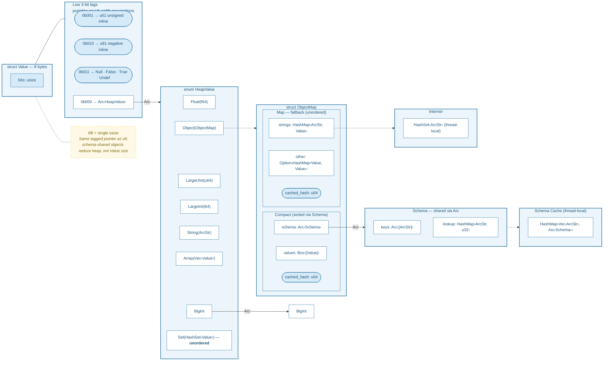

# v7: Tagged pointer + schema-shared objects (8 bytes)

```mermaid
graph LR
  subgraph V["struct Value — 8 bytes"]
    direction TB
    BITS["bits: usize"]
  end

  V -.- NOTE["8B = single usize<br/><i>Same tagged pointer as v6;<br/>schema-shared objects reduce heap, not Value size</i>"]

  subgraph TAGS["Low 3-bit tags<br/>portable: no VA-width assumptions"]
    direction TB
    UINT(["0b001 → u61 unsigned inline"])
    NINT(["0b010 → u61 negative inline"])
    IMM(["0b011 → Null · False · True · Undef"])
    PTR["0b000 → Arc‹HeapValue›"]
  end

  V --- TAGS

  subgraph HEAP["enum HeapValue"]
    direction TB
    HF["Float(f64)"]
    HBI["BigInt"]
    HLU["LargeUInt(u64)"]
    HLI["LargeInt(i64)"]
    HS["String(ArcStr)"]
    HA["Array(Vec‹Value›)"]
    HO["Object(ObjectMap)"]
    HSE["Set(HashSet‹Value›) — <b>unordered</b>"]
  end

  PTR -->|Arc| HEAP
  HBI -->|Arc| A0["BigInt"]
  HO -.-> OBJMAP

  subgraph OBJMAP["struct ObjectMap"]
    direction TB
    subgraph CBOX[" Compact (sorted via Schema) "]
      direction TB
      CSCHEMA["schema: Arc‹Schema›"]
      CVALS["values: Box‹[Value]›"]
      CHASH(["cached_hash: u64"])
    end
    subgraph MBOX[" Map — fallback (unordered) "]
      direction TB
      MSKHM["strings: HashMap‹ArcStr, Value›"]
      MMXHM["other: Option‹HashMap‹Value, Value››"]
      MHASH(["cached_hash: u64"])
    end
  end

  subgraph SCHEMA["Schema — shared via Arc"]
    direction TB
    SKEYS["keys: Arc‹[ArcStr]›"]
    SLOOKUP["lookup: HashMap‹ArcStr, u32›"]
  end

  CSCHEMA -->|Arc| SCHEMA

  subgraph INTERN["Interner"]
    direction TB
    ICACHE["HashSet‹ArcStr› (thread-local)"]
  end

  MSKHM -.-> INTERN

  subgraph SCACHE["Schema Cache (thread-local)"]
    direction TB
    SCTBL["HashMap‹Vec‹ArcStr›, Arc‹Schema››"]
  end

  SCHEMA -.-> SCACHE

  style INTERN fill:#EBF5FB,color:#1A5276,stroke:#2471A3,stroke-width:2px
  style ICACHE fill:#fff,color:#1A5276,stroke:#2471A3
  style SCACHE fill:#EBF5FB,color:#1A5276,stroke:#2471A3,stroke-width:2px
  style SCTBL fill:#fff,color:#1A5276,stroke:#2471A3
  style V fill:#EBF5FB,color:#1A5276,stroke:#2471A3,stroke-width:2px
  style BITS fill:#D6EAF8,color:#1A5276,stroke:#2471A3
  style TAGS fill:#EBF5FB,color:#1A5276,stroke:#2471A3,stroke-width:2px
  style UINT fill:#D6EAF8,color:#1A5276,stroke:#2471A3
  style NINT fill:#D6EAF8,color:#1A5276,stroke:#2471A3
  style IMM fill:#D6EAF8,color:#1A5276,stroke:#2471A3
  style PTR fill:#fff,color:#1A5276,stroke:#2471A3
  style HEAP fill:#EBF5FB,color:#1A5276,stroke:#2471A3,stroke-width:2px
  style HF fill:#fff,color:#1A5276,stroke:#2471A3
  style HBI fill:#fff,color:#1A5276,stroke:#2471A3
  style HLU fill:#fff,color:#1A5276,stroke:#2471A3
  style HLI fill:#fff,color:#1A5276,stroke:#2471A3
  style HS fill:#fff,color:#1A5276,stroke:#2471A3
  style HA fill:#fff,color:#1A5276,stroke:#2471A3
  style HO fill:#fff,color:#1A5276,stroke:#2471A3
  style HSE fill:#fff,color:#1A5276,stroke:#2471A3
  style A0 fill:#fff,color:#1A5276,stroke:#2471A3
  style OBJMAP fill:#EBF5FB,color:#1A5276,stroke:#2471A3,stroke-width:2px
  style CBOX fill:#EBF5FB,color:#1A5276,stroke:#2471A3
  style CSCHEMA fill:#fff,color:#1A5276,stroke:#2471A3
  style CVALS fill:#fff,color:#1A5276,stroke:#2471A3
  style CHASH fill:#D6EAF8,color:#1A5276,stroke:#2471A3
  style MBOX fill:#EBF5FB,color:#1A5276,stroke:#2471A3
  style MSKHM fill:#fff,color:#1A5276,stroke:#2471A3
  style MMXHM fill:#fff,color:#1A5276,stroke:#2471A3
  style MHASH fill:#D6EAF8,color:#1A5276,stroke:#2471A3
  style SCHEMA fill:#EBF5FB,color:#1A5276,stroke:#2471A3,stroke-width:2px
  style SKEYS fill:#fff,color:#1A5276,stroke:#2471A3
  style SLOOKUP fill:#fff,color:#1A5276,stroke:#2471A3
  style NOTE fill:#FEF9E7,color:#7D6608,stroke:#F1C40F,stroke-dasharray:5 5
```
