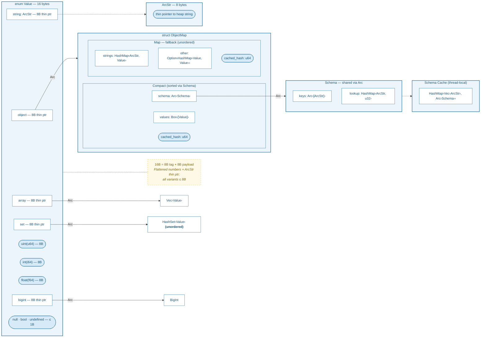

# v8: Flattened Number + schema objects (16 bytes)

```mermaid
graph LR
  subgraph V["enum Value — 16 bytes"]
    direction TB
    OBJ["object — 8B thin ptr"]
    STR["string: ArcStr — 8B thin ptr"]
    ARR["array — 8B thin ptr"]
    SET["set — 8B thin ptr"]
    N_U(["uint(u64) — 8B"])
    N_I(["int(i64) — 8B"])
    N_F(["float(f64) — 8B"])
    N_BI["bigint — 8B thin ptr"]
    INLINE(["null · bool · undefined — ≤ 1B"])
  end

  V -.- NOTE["16B = 8B tag + 8B payload<br/><i>Flattened numbers + ArcStr thin ptr;<br/>all variants ≤ 8B</i>"]

  OBJ -->|Arc| OBJMAP
  ARR -->|Arc| A2["Vec‹Value›"]
  SET -->|Arc| A3["HashSet‹Value› <b>(unordered)</b>"]
  N_BI -->|Arc| A0["BigInt"]

  subgraph OBJMAP["struct ObjectMap"]
    direction TB
    subgraph CBOX[" Compact (sorted via Schema) "]
      CSCHEMA["schema: Arc‹Schema›"]
      CVALS["values: Box‹[Value]›"]
      CHASH(["cached_hash: u64"])
    end
    subgraph MBOX[" Map — fallback (unordered) "]
      MSKHM["strings: HashMap‹ArcStr, Value›"]
      MMXHM["other: Option‹HashMap‹Value, Value››"]
      MHASH(["cached_hash: u64"])
    end
  end

  subgraph SCHEMA["Schema — shared via Arc"]
    direction TB
    SKEYS["keys: Arc‹[ArcStr]›"]
    SLOOKUP["lookup: HashMap‹ArcStr, u32›"]
  end

  CSCHEMA -->|Arc| SCHEMA

  subgraph SCACHE["Schema Cache (thread-local)"]
    direction TB
    SCTBL["HashMap‹Vec‹ArcStr›, Arc‹Schema››"]
  end

  SCHEMA -.-> SCACHE

  subgraph ARCSTR["ArcStr — 8 bytes"]
    direction TB
    ASPTR(["thin pointer to heap string"])
  end

  STR -.-> ARCSTR

  style V fill:#EBF5FB,color:#1A5276,stroke:#2471A3,stroke-width:2px
  style OBJ fill:#fff,color:#1A5276,stroke:#2471A3
  style STR fill:#fff,color:#1A5276,stroke:#2471A3
  style ARR fill:#fff,color:#1A5276,stroke:#2471A3
  style SET fill:#fff,color:#1A5276,stroke:#2471A3
  style N_U fill:#D6EAF8,color:#1A5276,stroke:#2471A3
  style N_I fill:#D6EAF8,color:#1A5276,stroke:#2471A3
  style N_F fill:#D6EAF8,color:#1A5276,stroke:#2471A3
  style N_BI fill:#fff,color:#1A5276,stroke:#2471A3
  style INLINE fill:#D6EAF8,color:#1A5276,stroke:#2471A3
  style A0 fill:#fff,color:#1A5276,stroke:#2471A3
  style A2 fill:#fff,color:#1A5276,stroke:#2471A3
  style A3 fill:#fff,color:#1A5276,stroke:#2471A3
  style OBJMAP fill:#EBF5FB,color:#1A5276,stroke:#2471A3,stroke-width:2px
  style CBOX fill:#EBF5FB,color:#1A5276,stroke:#2471A3
  style CSCHEMA fill:#fff,color:#1A5276,stroke:#2471A3
  style CVALS fill:#fff,color:#1A5276,stroke:#2471A3
  style CHASH fill:#D6EAF8,color:#1A5276,stroke:#2471A3
  style MBOX fill:#EBF5FB,color:#1A5276,stroke:#2471A3
  style MSKHM fill:#fff,color:#1A5276,stroke:#2471A3
  style MMXHM fill:#fff,color:#1A5276,stroke:#2471A3
  style MHASH fill:#D6EAF8,color:#1A5276,stroke:#2471A3
  style SCHEMA fill:#EBF5FB,color:#1A5276,stroke:#2471A3,stroke-width:2px
  style SKEYS fill:#fff,color:#1A5276,stroke:#2471A3
  style SLOOKUP fill:#fff,color:#1A5276,stroke:#2471A3
  style SCACHE fill:#EBF5FB,color:#1A5276,stroke:#2471A3,stroke-width:2px
  style SCTBL fill:#fff,color:#1A5276,stroke:#2471A3
  style ARCSTR fill:#EBF5FB,color:#1A5276,stroke:#2471A3,stroke-width:2px
  style ASPTR fill:#D6EAF8,color:#1A5276,stroke:#2471A3
  style NOTE fill:#FEF9E7,color:#7D6608,stroke:#F1C40F,stroke-dasharray:5 5
```
