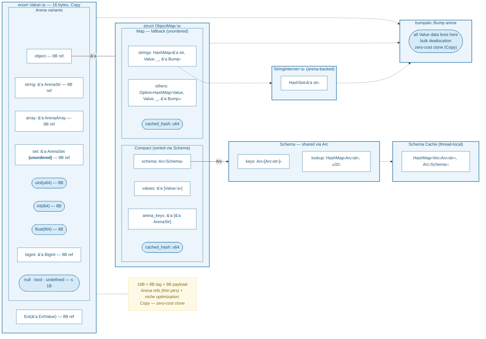

# v9: Arena-allocated, Copy Value (16 bytes)

```mermaid
graph LR
  subgraph V["enum Value‹'a› — 16 bytes, Copy"]
    direction TB
    subgraph ARENA["Arena variants"]
      direction TB
      OBJ["object — 8B ref"]
      STR["string: &'a ArenaStr — 8B ref"]
      ARR["array: &'a ArenaArray — 8B ref"]
      SET["set: &'a ArenaSet <b>(unordered)</b> — 8B ref"]
      N_U(["uint(u64) — 8B"])
      N_I(["int(i64) — 8B"])
      N_F(["float(f64) — 8B"])
      N_BI["bigint: &'a BigInt — 8B ref"]
      INLINE(["null · bool · undefined — ≤ 1B"])
    end
    EXT["Ext(&'a ExtValue) — 8B ref"]
  end

  V -.- NOTE["16B = 8B tag + 8B payload<br/><i>Arena refs (thin ptrs) + niche optimization;<br/>Copy — zero-cost clone</i>"]

  OBJ ---|&'a| OBJMAP

  subgraph OBJMAP["struct ObjectMap‹'a›"]
    direction TB
    subgraph CBOX[" Compact (sorted via Schema) "]
      CSCHEMA["schema: Arc‹Schema›"]
      CVALS["values: &'a [Value‹'a›]"]
      CKEYS["arena_keys: &'a [&'a ArenaStr]"]
      CHASH(["cached_hash: u64"])
    end
    subgraph MBOX[" Map — fallback (unordered) "]
      MSKHM["strings: HashMap‹&'a str, Value, _, &'a Bump›"]
      MMXHM["others: Option‹HashMap‹Value, Value, _, &'a Bump››"]
      MHASH(["cached_hash: u64"])
    end
  end

  subgraph SCHEMA["Schema — shared via Arc"]
    direction TB
    SKEYS["keys: Arc‹[Arc‹str›]›"]
    SLOOKUP["lookup: HashMap‹Arc‹str›, u32›"]
  end

  CSCHEMA -->|Arc| SCHEMA

  subgraph SCACHE["Schema Cache (thread-local)"]
    direction TB
    SCTBL["HashMap‹Vec‹Arc‹str››, Arc‹Schema››"]
  end

  SCHEMA -.-> SCACHE

  subgraph INTERN["StringInterner‹'a› (arena-backed)"]
    direction TB
    ISET["HashSet‹&'a str›"]
  end

  MSKHM -.-> INTERN
  INTERN -.-> BUMP

  subgraph BUMP["bumpalo::Bump arena"]
    direction TB
    BPOOL(["all Value data lives here<br/>bulk deallocation<br/>zero-cost clone (Copy)"])
  end

  V -.-> BUMP
  OBJMAP -.-> BUMP

  style V fill:#EBF5FB,color:#1A5276,stroke:#2471A3,stroke-width:2px
  style ARENA fill:#EBF5FB,color:#1A5276,stroke:#2471A3
  style OBJ fill:#fff,color:#1A5276,stroke:#2471A3
  style STR fill:#fff,color:#1A5276,stroke:#2471A3
  style ARR fill:#fff,color:#1A5276,stroke:#2471A3
  style SET fill:#fff,color:#1A5276,stroke:#2471A3
  style N_U fill:#D6EAF8,color:#1A5276,stroke:#2471A3
  style N_I fill:#D6EAF8,color:#1A5276,stroke:#2471A3
  style N_F fill:#D6EAF8,color:#1A5276,stroke:#2471A3
  style N_BI fill:#fff,color:#1A5276,stroke:#2471A3
  style INLINE fill:#D6EAF8,color:#1A5276,stroke:#2471A3
  style EXT fill:#fff,color:#1A5276,stroke:#2471A3
  style OBJMAP fill:#EBF5FB,color:#1A5276,stroke:#2471A3,stroke-width:2px
  style CBOX fill:#EBF5FB,color:#1A5276,stroke:#2471A3
  style CSCHEMA fill:#fff,color:#1A5276,stroke:#2471A3
  style CVALS fill:#fff,color:#1A5276,stroke:#2471A3
  style CKEYS fill:#fff,color:#1A5276,stroke:#2471A3
  style CHASH fill:#D6EAF8,color:#1A5276,stroke:#2471A3
  style MBOX fill:#EBF5FB,color:#1A5276,stroke:#2471A3
  style MSKHM fill:#fff,color:#1A5276,stroke:#2471A3
  style MMXHM fill:#fff,color:#1A5276,stroke:#2471A3
  style MHASH fill:#D6EAF8,color:#1A5276,stroke:#2471A3
  style SCHEMA fill:#EBF5FB,color:#1A5276,stroke:#2471A3,stroke-width:2px
  style SKEYS fill:#fff,color:#1A5276,stroke:#2471A3
  style SLOOKUP fill:#fff,color:#1A5276,stroke:#2471A3
  style SCACHE fill:#EBF5FB,color:#1A5276,stroke:#2471A3,stroke-width:2px
  style SCTBL fill:#fff,color:#1A5276,stroke:#2471A3
  style INTERN fill:#EBF5FB,color:#1A5276,stroke:#2471A3,stroke-width:2px
  style ISET fill:#fff,color:#1A5276,stroke:#2471A3
  style BUMP fill:#EBF5FB,color:#1A5276,stroke:#2471A3,stroke-width:2px
  style BPOOL fill:#D6EAF8,color:#1A5276,stroke:#2471A3
  style NOTE fill:#FEF9E7,color:#7D6608,stroke:#F1C40F,stroke-dasharray:5 5
```
